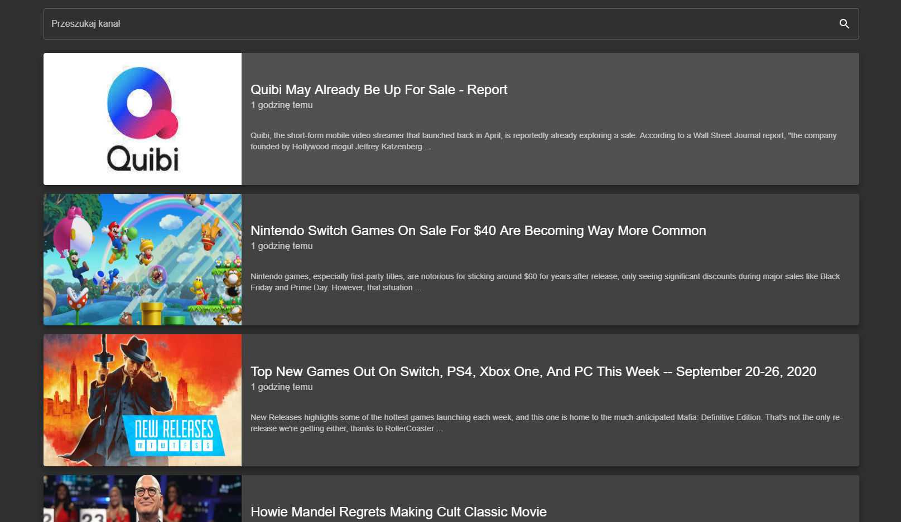

# Zadanie:

### Utwórz komponent/widżet podglądu treści kanału RSS

1. Utwórz komponent o nazwie FeedPreview.

2. Komponent jako argument props `url` przyjmuje url do kanału RSS.

3. Komponent ma wyświetlać podgląd aktualnych treści w kanale RSS.

4. Widok ma być ostylowany tak, aby był przyjazny dla internauty.

5. Funkcja szukania.

Komponent ma posiadać pole input do szukania wśród wpisów.

Szukanie ma się odbywać po tytule wpisu w kanale RSS.

6. Kiedy nie można pobrać danych pod danym adresem url, ma się wyświetlić komunikat o błędzie i przycisk do ponowienia pobrania.

# Wykonanie:

[Strona z rezultatem](url)

## Notatki:

-   Użyta technologia: **_React.js_**

-   Komponent przyjmuje argumenty `url` oraz `proxy`

-   `url` - adres url kanału RSS.

-   `proxy` - adres url serwera proxy (`url` będzie dopisany na koniec `proxy`)

-   Użyte biblioteki:

-   [Material-UI](https://material-ui.com)

-   [og-parser](https://www.npmjs.com/package/og-parser)

-   [rss-parser](https://www.npmjs.com/package/rss-parser)

-   [styled-normalize](https://www.npmjs.com/package/styled-normalize)
